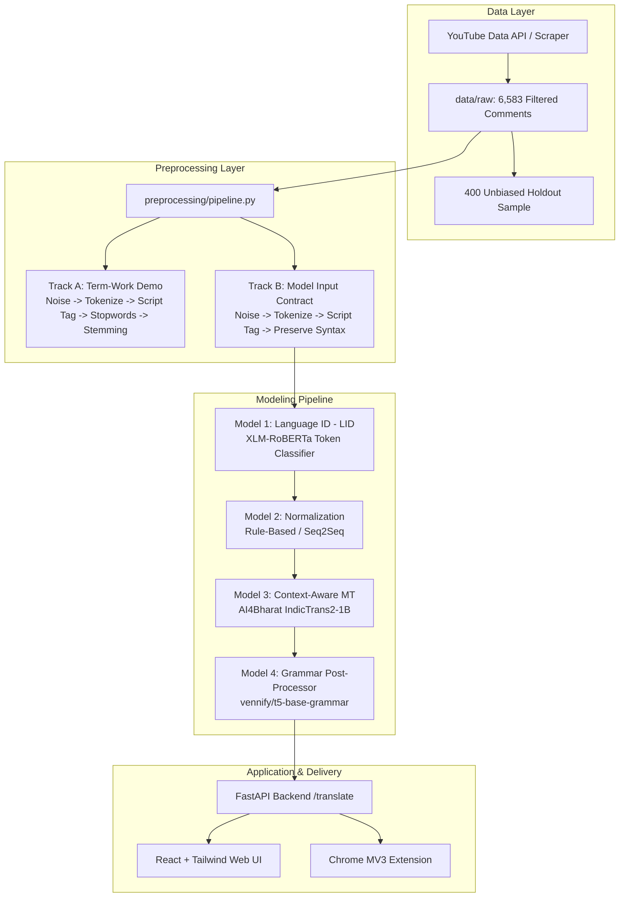
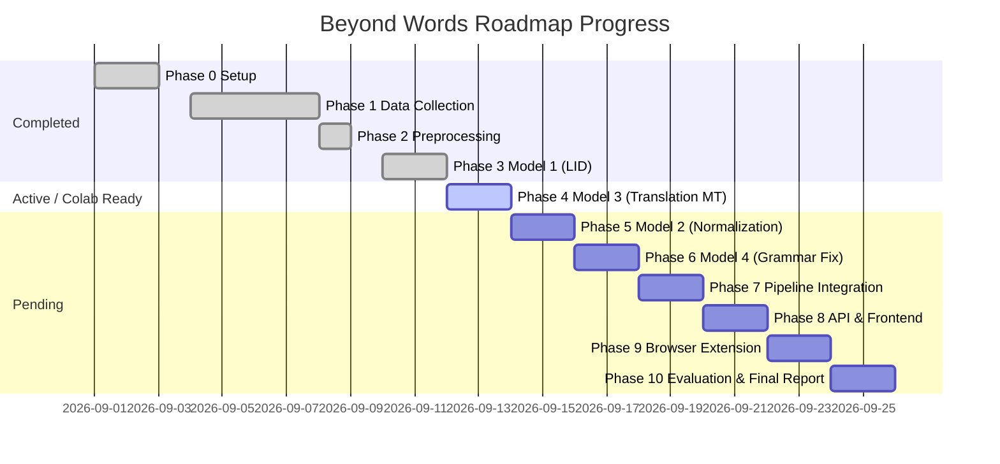
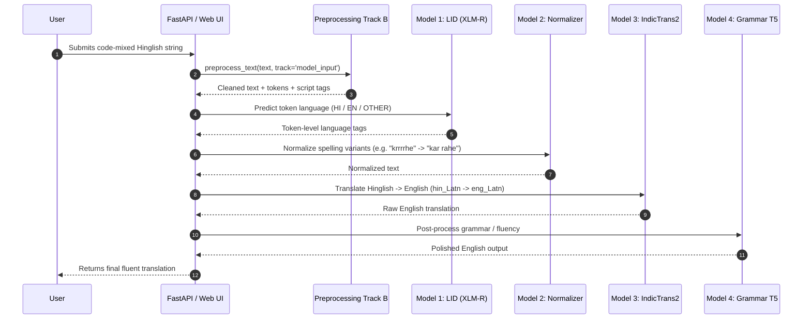

# Deep Project Analysis: Beyond Words
**Context-Aware Translation of Code-Mixed Indian Languages (Hinglish → English)**

---

## 1. Executive Summary

The **Beyond Words** project aims to solve one of the most pervasive natural language processing challenges in multilingual digital ecosystems: the context-aware translation of **code-mixed Indian languages** (specifically Hinglish: Hindi written in Latin script or mixed Devanagari/Latin script blended with English) into fluent English.

Unlike conventional machine translation systems designed for standard monolingual corpora, code-mixed text on social media exhibits extreme lexical ambiguity, non-standard phonetic orthography (*"kya kar rhe ho"* vs *"kya krrhe ho"*), informal colloquial slang, fluid code-switching points, and missing syntactic markers.

The project is structured around a **4-model sequential pipeline** with rigorous interface contracts, dual-track preprocessing, and strict compliance rules (`RULES.md`, `EVALUATION.md`, `TASKS.md`).

---

## 2. High-Level Pipeline & Architecture

### Stage Interface Contracts (`ARCHITECTURE.md §3`)

| Stage | Input Format | Output Format | Current Implementation Status |
|---|---|---|---|
| **Scraper** | Source queries / Seed IDs | Raw JSONL (`{source, text, timestamp, ...}`) | Complete (`scraper/youtube_scraper.py`) |
| **Preprocessor** | Raw JSONL text | JSON (`{cleaned, tokens, tagged}`) | Complete (`preprocessing/pipeline.py`, 7/7 tests pass) |
| **Model 1 (LID)** | Tokenized sentence | Token-level labels (`HI`, `EN`, `OTHER`) | Complete (`models/lid_colab.py`, XLM-RoBERTa) |
| **Model 2 (Norm)** | Tokens + LID labels | Normalized plain text (canonical orthography) | Pending (Phase 5) |
| **Model 3 (Translation)** | Normalized text | Translated English text | Colab Ready (`models/translation_colab.py`, IndicTrans2) |
| **Model 4 (Grammar)** | Raw translation | Polished English text | Pending (Phase 6) |
| **App Delivery** | User text input | Translated final text | Stubs in place (Phase 8–9) |

---

## 3. Detailed Phase-by-Phase Status Audit

### Phase 0: Setup & Scaffolding (Status: Complete)
- Directory layout established: `scraper/`, `preprocessing/`, `models/`, `scripts/`, `data/`, `logs/`.
- Pinned virtual environment (`.venv`) with `requirements.txt` and `package.json`.
- End-to-end hello world smoke script verified (`scripts/run_hello.py`).

### Phase 1: Data Collection (Status: Complete & Frozen)
- **Volume**: 6,583 active filtered comments across 85 JSONL files in `data/raw/`.
- **Domain Balance**:
  - Educational: 50.7% (~3,341 comments from Physics Wallah, Khan Sir, JEE/NEET/UPSC lectures).
  - Casual/Creators: 49.3% (~3,242 comments from CarryMinati, BB Ki Vines, Technical Guruji, Ashish Chanchlani, Slayy Point).
- **Caps & Quality**: Max 200 comments/video strictly enforced (`scripts/trim_caps.py`).
- **Privacy & Compliance**: SHA-256 PII hashing for usernames/emails implemented at collection time (`scraper/youtube_scraper.py`). Metadata logged in `logs/datasets_log.jsonl` (Rule R1.3).
- **Holdout Set**: 400 comments isolated in `data/raw/holdout_unbiased_sample.jsonl` for evaluation only (never used in training).
- **Quality Audit**: Strict 100-sample audit in `scripts/audit_and_clean.py` demonstrated a false-positive rate of 1.0% (well below the 5.0% tolerance ceiling).

### Phase 2: Preprocessing Layer (Status: Complete & Frozen)
- Implemented in `preprocessing/pipeline.py`.
- **The Dual-Track Architecture**:
  1. **Track A (Term-Work Demo)**: Demonstrates syllabus NLP techniques (noise removal → tokenization → script validation → bilingual stopword filtering → lemmatization/suffix stemming).
  2. **Track B (Model-Input Contract)**: Noise removal → tokenization → script tagging → **STOP**. No grammatical stripping.
- **Critical Semantic Preservation Fix**: Negation markers (`nahi`, `not`, `no`) and question markers (`kya`, `kahan`, `kaun`, `kyun`, `kaise`, `what`, `why`, `how`) are explicitly protected from stopword removal to preserve sentence polarity and interrogation.
- **Corpus Statistics**:
  - Latin tokens: 79,693 (96.0%)
  - Devanagari tokens: 895 (1.1%)
  - Garbage/Ambiguous dropped: 2,419 (2.9%)
  - Total observed: 83,007
- **Test Suite**: 7/7 unit tests passing in `preprocessing/test_preprocessing.py`.
- **Documented Limitation**: `indic-nlp-library` runtime resources on Windows had path issues; a rule-based Hindi suffix stemmer (`_hindi_suffix_stem`) was implemented and documented as an accepted fallback.

### Phase 3: Model 1 — Language Identification (Status: Complete for Checkpoint)
- **Base Architecture**: `xlm-roberta-base` fine-tuned for token classification (`HI`, `EN`, `OTHER`).
- **Weak Labeling**: Heuristic generation using 125 curated Roman-Hindi markers (`data/roman_hindi_markers.json`).
- **Data Splits**:
  - `models/lid_full.jsonl` (6.5k sentences)
  - `models/lid_train.jsonl` (80% train split)
  - `models/lid_holdout.jsonl` (20% holdout split)
  - Packaged bundle: `models/lid_dataset.zip`
- **Results & Limitations**:
  - 99.93% accuracy on weak holdout (explicitly noted as an optimistic upper bound reflecting heuristic replication rather than ground-truth human accuracy).
  - Qualitative sanity check on unseen Phase 1 holdout (`models/run_lid_sanity_check.py`) confirmed that essential Romanized Hindi function words (`hai`, `ki`, `ke`, `se`, `kya`, `nhi`, `aur`, `bhi`, `chahiye`) are correctly tagged.

### Phase 4: Model 3 — Context-Aware Translation (Status: Prepared & Colab Ready)
- Prioritized ahead of Model 2 per Rule R3.2.
- **Parallel Corpus Acquisition**:
  - **PHINC** (Twitter Hinglish-English parallel corpus): Downloaded from HuggingFace `veezbo/phinc`.
  - **Cleaning & Swap Filtering** (`scripts/prepare_phinc.py`, `scripts/investigate_phinc_swaps.py`):
    - Raw pairs: 13,738
    - Initial quality filter: 11,177 pairs
    - Swap & English-only filter: Removed 1,516 rows (13.6%) where target had more Hindi than source or source was pure English.
    - Final PHINC dataset: **8,694 training pairs** (`phinc_train_cleaned.jsonl`) and **967 validation pairs** (`phinc_validation_cleaned.jsonl`).
  - **CALCS Shared Task**: Ruled out after systematic investigation confirmed the domain server (ritual.uh.edu) and repositories were 404/unreachable.
- **Domain-Matched Evaluation Set (`data/youtube_eval.jsonl`)**:
  - Sampled 30 candidates from the 6,583 YouTube corpus (`scripts/sample_for_translation.py`).
  - Candidate 8 dropped due to PII placeholder; 29 sentences retained.
  - Transparent disclosure under Rule R6.1: Translated with LLM assistance due to timeline constraints, flagged with notes for garbled prefixes. Designated as "AI-assisted reference translations".
- **Colab Fine-Tuning Engine (`models/translation_colab.py`)**:
  - Model: `ai4bharat/indictrans2-indic-en-1B` (with `indictrans2-indic-en-dist-200M` fallback).
  - Includes **6 robust runtime compatibility monkey-patches**:
    1. `transformers.onnx` stub injection (removed in transformers >= 4.40).
    2. `_special_tokens_map` lazy bootstrap for `IndicTransTokenizer`.
    3. `huggingface_hub.HfFolder` stub injection (removed in hub >= 0.24).
    4. Custom `tie_weights(*args, **kwargs)` wrapper for `IndicTransForConditionalGeneration`.
    5. `IndicTransToolkit` import redirection (`tokenization_utils_base`).
    6. Global KV-cache disable to circumvent `EncoderDecoderCache` indexing errors during generation.
  - Evaluation reporting: Separate BLEU for PHINC-val (in-domain) and YouTube-eval (out-of-domain).

---

## 4. Pending Phases & Implementation Blueprint

### Phase 5: Model 2 — Normalization
- **Objective**: Standardize chaotic informal spelling variants (*"plzzz"*, *"shyd"*, *"krrrha"*, *"bht"*, *"gayaaaa"*) before passing into Model 3.
- **Rule R3.3 Decision**:
  - Option A: Seq2Seq fine-tuning on `google/mt5-small`.
  - Option B: Rule-based normalizer (repeated character reduction, Levenshtein distance matching against the 125 Roman-Hindi marker lexicon, and dictionary lookup).
  - *Recommendation*: Start with a robust rule-based normalizer (which is deterministic, fast, zero-GPU, and directly testable) while documenting the decision in compliance with Rule R3.3.

### Phase 6: Model 4 — Grammar / Fluency Correction
- **Objective**: Ensure final English translation is idiomatically natural.
- **Model**: Off-the-shelf `vennify/t5-base-grammar-correction` or `prithivida/grammar_error_correcter_v1`.
- **Constraint**: Must verify zero meaning drift on 10+ spot-checked outputs.

### Phase 7: Pipeline Integration
- Combine Track B Preprocessor → Model 1 (LID) → Model 2 (Normalizer) → Model 3 (Translation) → Model 4 (Grammar) into a single unified Python module: `models/pipeline_e2e.py`.
- Run 10 end-to-end integration tests without manual intervention.

### Phase 8 & 9: API, Frontend, & Browser Extension
- **Backend**: FastAPI with `/translate` endpoint in `api/main.py`.
- **Frontend**: Modern React + Tailwind interface (or lightweight single-page web app).
- **Extension**: Chrome Manifest V3 popup/content script calling `/translate`.

### Phase 10: Evaluation & Final Report
- Compute quantitative metrics: BLEU, METEOR, BERTScore.
- Compile 5+ qualitative before/after examples comparing naive word-for-word translation against the system output.
- Complete the final documentation adhering to `RULES.md §6` and `EVALUATION.md`.

---

## 5. Codebase Health & Quality Assessment

| Dimension | Rating | Observations & Findings |
|---|---|---|
| **Architecture & Modularity** | **Exceptional** | Strict separation of concerns across scraping, preprocessing, modeling, and logging. Clear interface schemas. |
| **Documentation & Transparency** | **Exceptional** | Phase summaries, limitation disclosures, dataset provenance logs, and architectural decision records are detailed and honest. |
| **Test Coverage** | **Good** | Preprocessing has full pytest regression tests covering edge cases, script tagging, and negation preservation. |
| **Error Handling & Compatibility** | **Outstanding** | `translation_colab.py` exhibits rare depth in patching HuggingFace/PyTorch version incompatibilities for IndicTrans2. |
| **Data Governance** | **Strict** | Full PII scrubbing, dataset metadata logging (`logs/datasets_log.jsonl`), and strict holdout isolation. |

---

## 6. Recommended Next Actions

1. **Colab Execution for Translation (Phase 4)**:
   - Upload `models/translation_colab.py`, `phinc_train_cleaned.jsonl`, `phinc_validation_cleaned.jsonl`, and `youtube_eval.jsonl` to Google Colab T4.
   - Run fine-tuning for 3 epochs and export the trained model checkpoint.
2. **Implement Normalization (Phase 5)**:
   - Build `models/normalizer.py` implementing character collapse, edit-distance lexicon mapping, and test against common Hinglish orthographic variants.
3. **Wire Pipeline Integration (Phase 7)**:
   - Create an end-to-end integration wrapper that can take any user string and pass it through all available pipeline stages.
